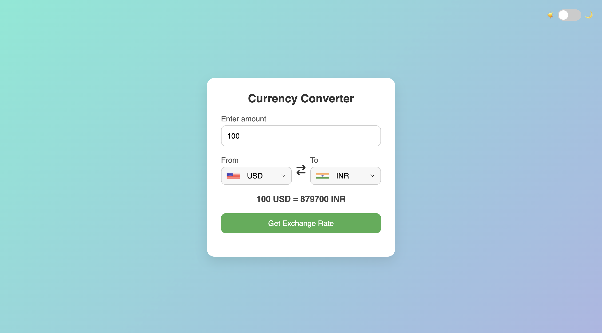
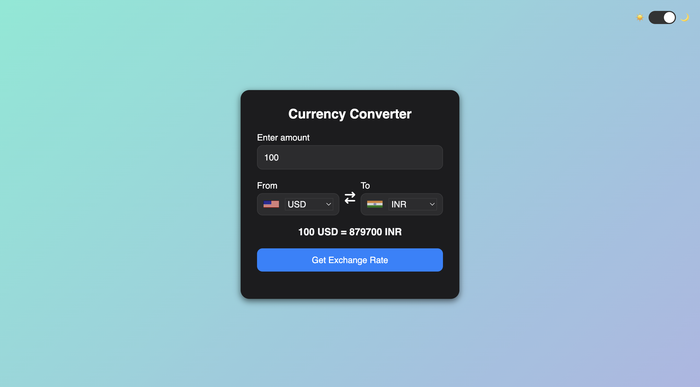
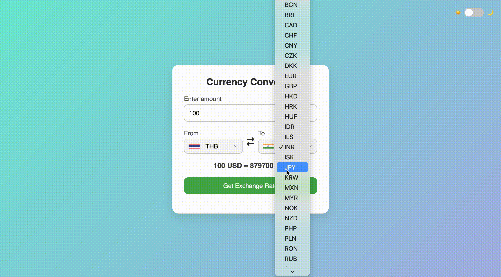

# 💱 Currency Converter

A sleek and simple **Currency Converter Web App** that allows users to convert between currencies in real time.  
Built with **HTML, CSS, and JavaScript**, featuring a **responsive design** and **dark mode toggle** for a modern look.

---

## ✨ Features
- 🌐 Real-time exchange rate updates  
- 🌙 **Dark Mode** support  
- 💫 Smooth transitions and animations  
- 📱 Fully responsive design  
- ⚡ Fast and lightweight – no frameworks required  

---

## 🛠️ Tech Stack
- **HTML5**
- **CSS3**
- **JavaScript (Vanilla)**  
- [Font Awesome](https://fontawesome.com/) for icons  
- [FlagsAPI](https://flagsapi.com/) for country flags  

---

## 📸 Screenshots

### Light Mode

### Dark Mode

### Demo GIF

---

## 💡 Inspiration
This project was inspired by a YouTube tutorial.  
I customized the **UI**, added **dark mode**, and enhanced **animations** to make it more polished and user-friendly.
